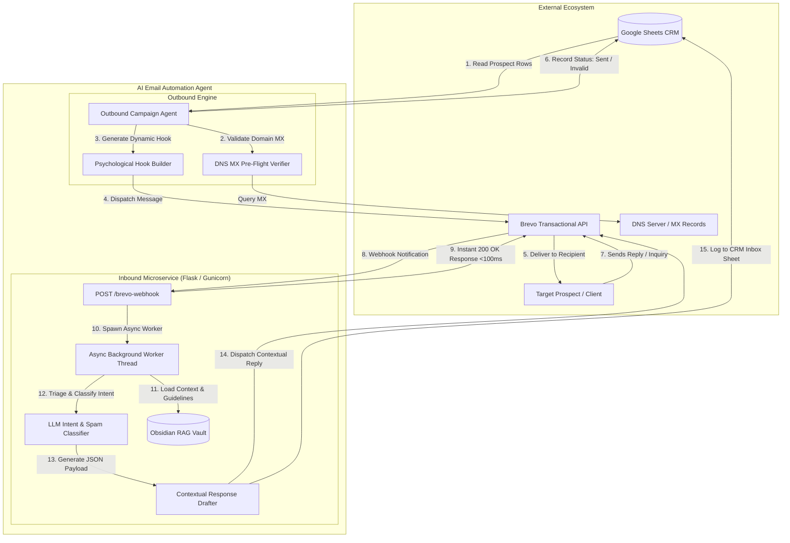

<div align="center">


</div>

<div align="center">
  <h1>🤖 AI Email Automation Agent</h1>
  <p><strong>Autonomous Enterprise Agent for Outbound Lead Engagement, Asynchronous Webhook Triage, DNS Pre-Flight Verification, and Real-Time CRM Synchronization.</strong></p>
  
  <p>
    <a href="https://youtu.be/7POD0rk6Xkg"><strong>📺 Watch Live Video Demo (YouTube) »</strong></a>
  </p>
</div>

---

## 💡 Why This Project?

Managing high-volume B2B cold outreach and customer inbound inquiries typically requires juggling expensive third-party platforms (Instantly, Lemlist, Zapier) and countless manual hours sorting through spam, notifications, and genuine business leads.

> **The Problem:** 
> - **Domain Blacklisting:** Sending outbound emails to invalid domains causes high bounce rates (>5%), ruining sender reputation and blacklisting core domains.
> - **Operational Chaos:** Founders and sales teams spend hours manually qualifying leads, answering repetitive inquiries, and tracking follow-ups.
> - **Webhook Timeouts:** Standard synchronous webhook handlers time out when invoking deep LLM reasoning models, resulting in duplicate email floods and dropped payloads.
>
> **The Solution:** 
> An autonomous, cloud-ready AI Agent microservice that performs pre-flight DNS MX verification, injects dynamic psychological hooks, acknowledges incoming webhooks in `< 100ms` via asynchronous threading, filters out noise/spam with DeepSeek LLM intelligence, and generates RAG-grounded consultative replies synchronized with a Google Sheets CRM.

---

## ⚡ Key Features

- **🛡️ Pre-Flight DNS MX Verification:** Automatically validates recipient domain mail exchange (MX) records via DNS resolver before dispatching cold emails—preventing deliverability penalties and zero-bounce failures.
- **⚡ Asynchronous Inbound Webhook Triage:** Engineered with non-blocking daemon threading to return `200 OK` to Brevo within `< 100ms`, preventing webhook timeouts while LLMs perform deep contextual reasoning.
- **🧠 Two-Stage LLM Intent & Spam Shield:** Utilizes DeepSeek / OpenAI models to strictly distinguish genuine human business inquiries from automated notifications, newsletters, OTPs, and sales spam.
- **📚 RAG-Grounded Knowledge Vault:** Integrates an Obsidian-style markdown knowledge base containing company positioning, service offerings, and objection-handling rules to draft high-status consultative responses.
- **🔁 Autonomous 48-Hour Follow-Up Engine:** Automatically tracks prospects, suppresses emails to leads who have already replied, and schedules tailored value-oriented follow-ups after 48 hours.
- **📊 Real-Time Google Sheets CRM Sync:** Maintains real-time state for both outbound campaign delivery statuses and inbound triage logs in Google Sheets.

---

## 🎬 Video Walkthrough

Watch the complete architecture walkthrough and live end-to-end execution of the agent:

[](https://youtu.be/7POD0rk6Xkg)

---

## 🏗️ Architecture & Dataflow



---

## 🛠️ Tech Stack

| Component | Technology | Purpose |
|---|---|---|
| **Language** | Python 3.10+ / 3.11 / 3.12 | Core agent logic and microservice execution |
| **LLM Engine** | DeepSeek V4 / OpenAI API (Nvidia NIM) | Intent classification, noise filtering, and consultative drafting |
| **Web Framework** | Flask 3.0+ & Gunicorn | Production webhook listener with asynchronous threading |
| **Email Delivery** | Brevo (Sendinblue) API | Transactional outbound sending and inbound webhook relay |
| **DNS Resolution** | `dnspython` | Real-time DNS MX record pre-flight deliverability verification |
| **CRM Backend** | Google Sheets API (`gspread` / `oauth2client`) | Bi-directional lead tracking, deduplication, and inbox audit logging |
| **Containerization** | Docker & Docker Compose | Cloud containerized deployment and health monitoring |

---

## 🚀 Quick Start

### Prerequisites
- Python 3.10 or higher
- Brevo Account (API Key & verified sender domain/subdomain)
- Google Cloud Service Account (with Google Sheets & Drive API enabled)
- LLM API Key (OpenAI or Nvidia NIM DeepSeek endpoint)

### 1. Clone & Setup Environment

```bash
# Clone the repository
git clone https://github.com/akashchandradas7/ai-email-automation-agent.git
cd ai-email-automation-agent

# Create virtual environment
python -m venv .venv
source .venv/bin/activate  # On Windows: .venv\Scripts\activate

# Install dependencies
pip install -e ".[dev]"

# Configure environment variables
cp .env.example .env
```

### 2. Configure Credentials (`.env`)

Edit `.env` with your verified service credentials:

```bash
# Brevo Settings
BREVO_API_KEY=xkeysib-your-brevo-api-key
SENDER_EMAIL=info@yourdomain.com
SENDER_NAME=GrowthFlow Team
REPLY_TO_EMAIL=hello@support.yourdomain.com

# LLM Configuration
LLM_API_KEY=your-llm-api-key
LLM_BASE_URL=https://integrate.api.nvidia.com/v1
LLM_MODEL=deepseek-ai/deepseek-v4-pro

# Google Sheets CRM
SHEET_LINK=https://docs.google.com/spreadsheets/d/your-sheet-id/edit
CREDENTIALS_FILE=credentials.json
```

### 3. Run the Microservice

```bash
# Run locally with Flask
python -m src.main

# Or run with production Gunicorn
gunicorn --bind 0.0.0.0:5000 src.main:app
```

### 4. Run with Docker

```bash
# Build and run containerized service
docker-compose up --build -d
```

### 5. Using Makefile Shortcuts

```bash
make setup    # Set up virtual environment and install packages
make run      # Start local microservice
make test     # Execute automated pytest test suite
make lint     # Run Ruff linter and code style checker
```

---

## 📂 Project Structure

```text
ai-email-automation-agent/
├── .github/
│   ├── workflows/
│   │   └── ci.yml               # GitHub Actions automated lint & test pipeline
│   ├── ISSUE_TEMPLATE/          # Issue reporting templates
│   └── SECURITY.md              # Vulnerability reporting guidelines
├── src/
│   ├── agents/
│   │   ├── classifier.py        # LLM intent classification & spam shield
│   │   ├── reply_generator.py   # RAG-grounded contextual response builder
│   │   └── outbound_agent.py    # Outbound campaign dispatcher & 48h follow-up engine
│   ├── tools/
│   │   ├── brevo_client.py      # Brevo transactional API client
│   │   ├── sheets_client.py     # Google Sheets CRM synchronization
│   │   └── email_verifier.py    # DNS MX record pre-flight verifier
│   ├── knowledge_base/          # Obsidian RAG context vault
│   │   ├── 1_Company_Info.md
│   │   ├── 2_Rules.md
│   │   └── 3_Email_Templates.md
│   ├── config/
│   │   └── settings.py          # Typed settings manager
│   ├── utils/
│   │   └── logger.py            # Structured logging utility
│   └── main.py                  # Production Flask webhook entrypoint
├── tests/
│   ├── test_classifier.py       # Intent classification unit tests
│   ├── test_verifier.py         # DNS MX resolution tests
│   ├── test_webhook.py          # Integration tests for webhook endpoints
│   └── conftest.py              # Shared fixtures
├── docs/
│   ├── architecture.md          # Deep dive architecture documentation
│   └── api.md                   # Webhook payload & endpoint contracts
├── .env.example                 # Sanitized environment template
├── .gitignore
├── .dockerignore
├── Dockerfile
├── docker-compose.yml
├── Makefile
├── pyproject.toml
├── AGENTS.md                    # Instructions for AI Coding Agents
├── CLAUDE.md
├── CONTRIBUTING.md
├── SECURITY.md
└── README.md
```

---

## 🧪 Testing

The repository includes a comprehensive test suite covering DNS verification, LLM classification JSON parsing, and asynchronous webhook handling:

```bash
# Run pytest with verbose output
pytest tests/ -v

# Run pytest with code coverage analysis
pytest tests/ --cov=src --cov-report=term-missing
```

---

## 🔒 Note on Client Confidentiality

> **Confidentiality Notice:** This repository contains a sanitized, generalized implementation of an autonomous agent system originally developed for production use. All proprietary client data, specific domain identities, and real API credentials have been removed or replaced with synthetic placeholders in compliance with strict confidentiality standards.

---

## 👨‍💻 Author

**Akash Chandra Das**  
*Building AI agents, automation & RAG Systems | Founder @ GrowthFlow*

- 🌐 **Portfolio / Website:** [growthflow.ltd](https://growthflow.ltd/)
- 💼 **LinkedIn:** [linkedin.com/in/akash-chandradas](https://www.linkedin.com/in/akash-chandradas/)
- 🐦 **X / Twitter:** [@akashcdas](https://x.com/akashcdas)
- 📧 **Email:** [akashcdasbd@gmail.com](mailto:akashcdasbd@gmail.com)
- 📺 **YouTube Live Demo:** [Watch Demo](https://youtu.be/7POD0rk6Xkg)
